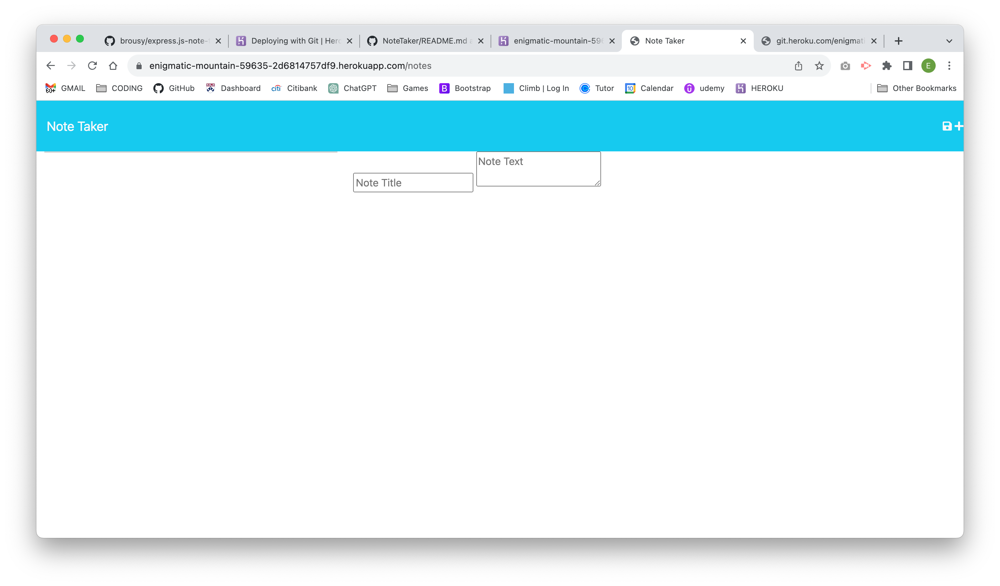
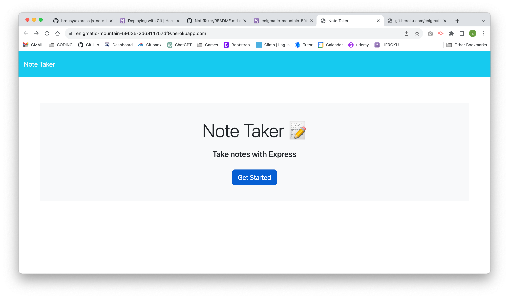

# Note Taker Application

## Description
This is a web application for taking notes. It allows user to create, save and delete notes. The application us built using Express.js, Node.js on the back-end and HTML, CSS, and Javascript on the front end. 

## User Story
```md
AS A small business owner
I WANT to be able to write and save notes
SO THAT I can organize my thoughts and keep track 
```
## Acceptance Criteria
```md
GIVEN a note-taking application
WHEN I open the Note Taker
THEN I am presented with a landing page with a link to a notes page
WHEN I click on the link to the notes page
THEN I am presented with a page with existing notes listed in the left-hand column, plus empty fields to enter a new note title and the note’s text in the right-hand column
WHEN I enter a new note title and the note’s text
THEN a Save icon appears in the navigation at the top of the page
WHEN I click on the Save icon
THEN the new note I have entered is saved and appears in the left-hand column with the other existing notes
WHEN I click on an existing note in the list in the left-hand column
THEN that note appears in the right-hand column
WHEN I click on the Write icon in the navigation at the top of the page
THEN I am presented with empty fields to enter a new note title and the note’s text in the right-hand column
```
## Installation

To run the application, you need to have Node.js and npm (Node Package Manager) installed on your machine. If you don't have them installed, you can download and install them from the official Node.js website https://nodejs.org/.

1. Clone the repository:
``` git clone https://github.com/brousy/express.js-note-taker.git```
2. Install dependencies:

``` npm install```

3. Start the server:
Copy code
``` node server.js```

4. Open the application in your web browser:
``` http://localhost:3000/```


## Usage
Create a note

1. Click on the "Note Title" input field and enter a title for your note
2. Click on the "Note Text" input field and enter the content of your note.
3. Click on the save icon in the top-right corner of the screen or press the "Ctrl + S" keyboard shortcut to save the note.

View a note

1. Click on the title of the note you want to view in the left-hand column
2. The content of the note will be displayed in the main area of the screen.

## License
This project is licensed under the MIT License - see the LICENSE file for details.

## Live Link

(Heroku App Link)[https://enigmatic-mountain-59635-2d6814757df9.herokuapp.com/]

## Screen Shots



